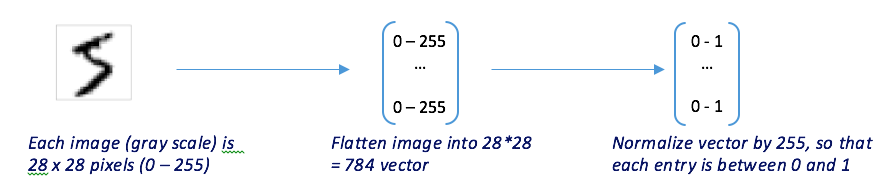
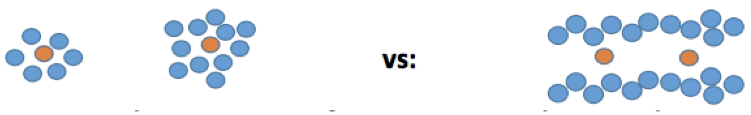
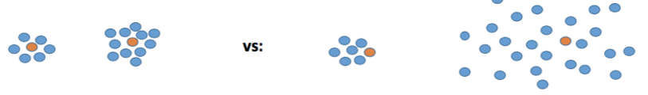
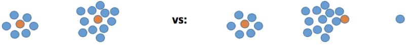
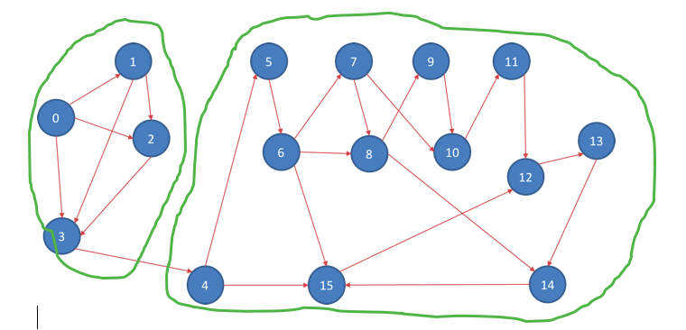

# Examples of Clustering on Spark

## Part 1 - MNIST Clustering Example

The MNIST dataset of handwritten digits (derived from a larger dataset called NIST). Its initial purpose was to train classifiers to understand hand-written postal addresses.

Each image is of size 28 x 28, where each pixel value is between 0 - 255. This tutorial walks you through how to apply KMeans to cluster these images.

-- Step 1 - Feature Extraction 

First, we need to decide how to extract features from the raw images. One idea is to transform the 2-D image (28 x 28) into a flat vector (of size 784). The vector values must be normalized so that each entry is between 0 and 1. To compare two vectors, we will use Euclidean distance (actually as of Spark 2.0, only Euclidean is supported as a distance measure for KMeans).



-- Step 2 - Train KMeans --

We will use PYSpark and MLlib for this problem. Will feed-in the raw
data to KMeans and train the model, and then evaluate the resulting
model.

You can download the data from : <http://yann.lecun.com/exdb/mnist/>

```python
mnist_train = sc.textFile(fileNameTrain) 

def parsePoint(line):
	values = line.split(',')
	values = [0 if e == '' else int(e) for e in values]
	return values[1:] 

mnist_train = mnist_train.filter(lambda x:x !=header) 

parsedData = data.map(parsePoint) 

clusters = KMeans.train(trainingData, 2, maxIterations=10,initializationMode="random")
```

Once we have obtained the clusters, we can compute the sum of squared
distances using: ``` clusters.computeCost( data ) ```

Given a new data point, to classify which cluster this data point
belongs to, we can use : ``` clusters.predict ( data )```

Example code given by  MNIST_Kmeans.py. To run the code ``` <path-to-spark>/bin/spark-submit mnist_kmeans.py ```

Note, if you wanted to apply hierarchical clustering, then use Bisecting KMeans instead.

## Part 2 - LDA for Document Clustering 

Consider the problem of clustering documents, possibly based on topics.
One approach is to apply the standard KMeans algorithm using Cosine
Similarity measure to generate the clusters. Unfortunately, PySpark’s
KMeans only uses a Euclidean measure, so its not appropriate for this
problem. So, let us consider another approach.

Latent Dirichlet allocation (LDA) is a [topic model](http://en.wikipedia.org/wiki/Topic_model) that generates topics based on word frequency from a set of documents. LDA is particularly useful for finding reasonably accurate mixtures of topics within a given document set.

LDA assumes documents are produced from a mixture of topics. Those topics then generate words based on their probability distribution. In other words, LDA assumes a document is made from the following steps:

1. Determine the number of words in a document. Lets say our document has 6 words.

2. Determine the mixture of topics in that document. For example, the document might contain 1/2 the topic 'health' and 1/2 the topic 'vegetables'.

3.  Using each topic's multinomial distribution, output words to fill the documents word slots. In our example, the health topic is 1/2 our document, or 3 words. The health topic might have the word diet at 20\% probability or exercise at 15\%, so it will fill the document word slots based on those probabilities.

Given this assumption of how documents are created, LDA backtracks and tries to figure out what topics would create those documents in the first place.

Data cleaning is absolutely crucial for generating a useful topic model: as the saying goes, 'garbage in, garbage out.' The steps below are common to most natural language processing methods:

-   Tokenizing: converting a document to its atomic elements.

-   Stopping: removing meaningless words.

Example given by topics_lda.py. To run the code ``` <path-to-spark>/bin/spark-submit topics_lda.py ```

## Part 3 - Clustering Tweets By Language 

Tweets are mostly raw, not tagged with geo location or language. One task is to use KMeans to cluster a training set of tweets by language.
Then, given a new tweet, classify the cluster this tweet belongs to and hence classify the language of the tweet.

The full tutorial is found here:
<https://databricks.gitbooks.io/databricks-spark-reference-applications/twitter_classifier/index.html>

## Part 4 - Power Iteration Clustering 
=====================================

KMeans has several weaknesses, including:

-   Assumes that clusters are of spherical shape

    

-   Assume that clusters are of equal size

    

-   Sensitive to outliers

    

Spectral clustering is another method that use the eigenvectors of a
graph Laplacian matrixto cluster a graph.



Power Iteration Clustering is a spectral clustering method for
clustering vertices of a graph given pairwise similarities as edge
properties, described in [Lin and Cohen, Power Iteration
Clustering](http://www.icml2010.org/papers/387.pdf).

Assume we have the above graph, we can see that there are basically two
cliques in the graph assuming that each edge has an equal weight. Our
goal is to find an accurate cut in the graph.

Example code given by  graph_pic.py. To run the code ``` <path-to-spark>/bin/spark-submit graph_pic.py ```
